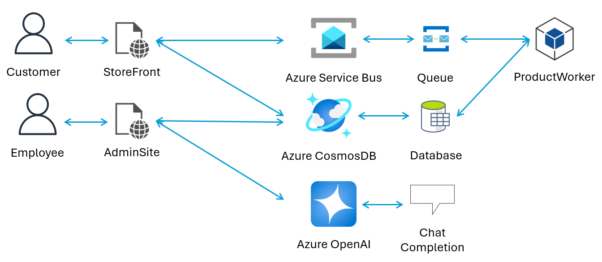
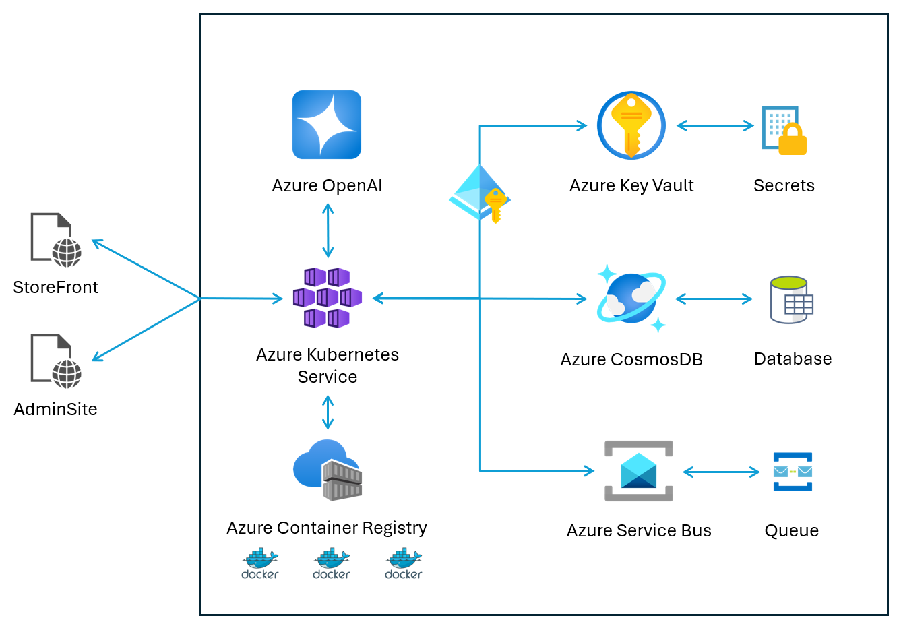

<!-- markdownlint-disable MD013 MD033 MD041 -->

<!-- PROJECT SHIELDS -->

[![Contributors][contributors-shield]][contributors-url]
[![Forks][forks-shield]][forks-url]
[![Stargazers][stars-shield]][stars-url]
[![Issues][issues-shield]][issues-url]
[![MIT License][license-shield]][license-url]
[![Azure][azure-shield]][azure-url]

---

## AI for IT/Ops workshop

Welcome to the AI for IT/Ops workshop! This repository contains all the materials necessary to deploy and run the AI for IT/Ops workshop. If you have the sample application from this repository ready, or just want to check the workshop instructions, jump to the [Workshop folder's ReadMe.md](./Workshop/ReadMe.md) file.

This repository consists of a few important assets:

- A sample e-commerce application that leverages Azure OpenAI to provide AI-powered product recommendations.
- Instructions on how to deploy the sample application using Azure Developer CLI (azd) and Infrastructure as Code (Bicep). Use this option to quickly deploy the environment and jump into the workshop exercises.
- Instructions on how to deploy the sample application using PowerShell scripts. Use this option to understand the individual steps necessary to deploy the environment.

For requests of new scenarios or issues with the workshop, please use the Issues tab to open a GitHub issue. We will do our best to look at all issues regularly.

## Prerequisites

- Azure subscription - you can obtain a free trial from [Azure Free Trial](https://aka.ms/azure-free-account)
- Azure Developer CLI (azd) installed and logged in
- PowerShell 7.x installed (if using PowerShell scripts)
- Azure CLI (`az`) installed and logged in
- Kubernetes CLI (`kubectl`) installed
- Git CLI (`git`) installed
- Appropriate Azure quota for all the services used in this workshop
- Clone this repo to a folder on your device using `git clone https://github.com/microsoft/AIforITOps.git`.

## Application and Azure architecture

The sample app used in this workshop emulates an e-commerce platform. While extremely simple, the sample app leverages many architectural and security best-practices, like: micro-services, service queues, secrets for connection strings and Keys, etc.

The e-commerce portion of the app is describes in this architecture diagram:

The Azure services utilized in the sample application and their relationship is described in the following architectural diagram:

## Deploy the sample application

The recommended way to deploy the sample application is by using Azure Developer CLI (azd). The [AZD-SETUP.md](./AZD-SETUP.md) file contains all the necessary instructions to deploy the application using azd. Alternatively, you can deploy the application using PowerShell scripts. The [PS-SETUP.md](./PS-SETUP.md) file contains all the necessary instructions to deploy the application using PowerShell scripts.

## Presentation

Download the AI for ITOps presentation [here](https://aka.ms/ignite25/prel19-slides).

<!-- MARKDOWN LINKS & IMAGES -->

[contributors-shield]: https://img.shields.io/github/contributors/microsoft/AIforITOps.svg?style=for-the-badge
[contributors-url]: https://github.com/microsoft/AIforITOps/graphs/contributors
[forks-shield]: https://img.shields.io/github/forks/microsoft/AIforITOps.svg?style=for-the-badge
[forks-url]: https://github.com/microsoft/AIforITOps/network/members
[stars-shield]: https://img.shields.io/github/stars/microsoft/AIforITOps.svg?style=for-the-badge
[stars-url]: https://github.com/microsoft/AIforITOps/stargazers
[issues-shield]: https://img.shields.io/github/issues/microsoft/AIforITOps.svg?style=for-the-badge
[issues-url]: https://github.com/microsoft/AIforITOps/issues
[license-shield]: https://img.shields.io/github/license/microsoft/AIforITOps.svg?style=for-the-badge
[license-url]: https://github.com/microsoft/AIforITOps/blob/main/LICENSE
[azure-shield]: https://img.shields.io/badge/Azure-0078D4?style=for-the-badge&logo=microsoftazure&logoColor=white
[azure-url]: https://azure.microsoft.com/
